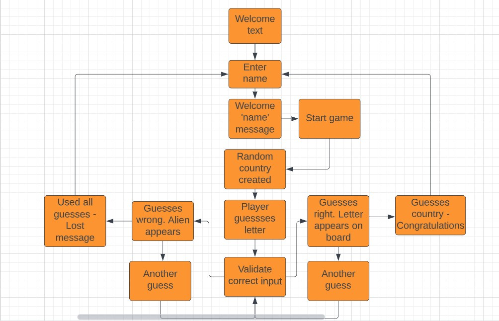
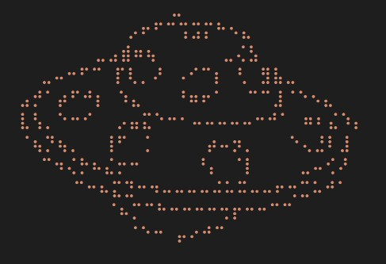
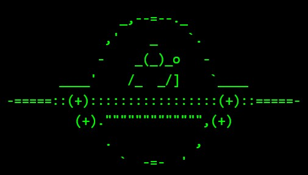
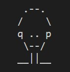
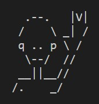
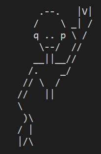
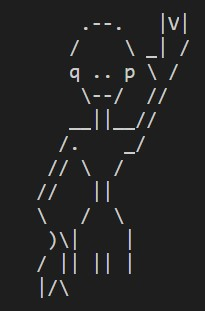
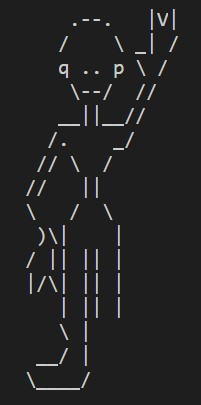
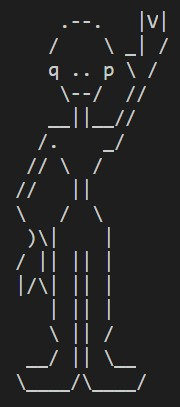
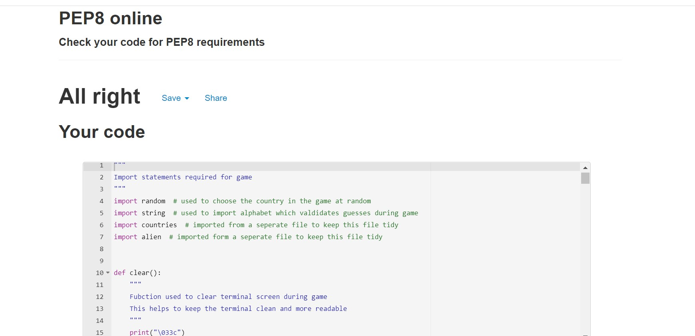

# ALIEN INVASION 2022

This is a python terminal guessing game. The game is based on the classic hangman game, whereupon the user has to guess the country which the aliens are going to invade. The user has a set number of guesses to get the answer before the aliens invade.

The game is aimed at people who like guessing games and who may have an interest in the countries of the world. Due to the content younger children might get frustrated due to the knowledge of countries of the world being needed to complete the game. With this in mind the game is suitable for players of age 10 and up.

[Live game can be found here](https://alien-invasion-2022.herokuapp.com/)

***

# Index
* [User Experience](#user-experience-ux)
* [Features](#features)
  * [Flow Chart](#flow-chart)
  * [Welcome Screen](#welcome-screen)
  * [Rules](#rules)
  * [Game](#game)
  * [Logos](#logos)
  * [Aliens](#alien)
  * [Play Again](#play-again)
  * [Future Features](#future-features)
* [Technologies used](#technologies-used)
* [Design](#design)
* [Testing](#testing)
  * [Testing User Stories](#testing-user-stories)
  * [Validator testing](#validator-testing)
  * [Functionality](#functionality)
* [Bugs](#bugs)
* [Deployment](#deployment)
  * [Cloning/Forking](#cloningforking)
* [Credits](#credits)

***

# User Experience (UX)
As a user I want to be able to:
* Be able to navigate any options available
* Understand the rules of the game
* Have a large choice of guesses so the game doesn't repeat itself too often
* See how many guesses I have left
* Have a clear option to start the game again
* Enjoy the game
***

# Features
## Current Features
### Flow Chart
* I initially created a flow chart to help me plan the game.

### Welcome Screen
* This is displayed when the game starts
* It shows a UFO using ASCII art and the title of the game
* It gives the user the option to read the rules by pressing 1 or play the game by entering any other key

### Rules
* The rules are written as if they are written by the aliens who are about to invade
* They tell the user what the game is about and asks for their name
* There is also a different UFO ASCII art design

### Game
* The game starts by showing the following:
    * How many letters are in the secret word
    * The same number of dashes that are in the secret word, which is an echo to the Hangman game
    * How many guesses the user has left
    * Input for the user to guess a letter
* As the game progresses a part of an alien appears for every wrong guess, and a Well Done message for every correct guess.
* The game continues until all guesses are used up or the correct country has been guessed
* At the end of the game the user has the option to play again

### Logos
* Two logos are used in the game to enhance the user experience.
* The first is used on the opening page to give the user a visual cue to what the game is about.

* The second image is used to break up the text of the game and to further enhance the visuality of the game.

### Alien
* The Alien is used to give the user a visual guide to how many guesses they have left.

### Play Again
* Once the game has finished the user gets a winner or loser message. They then get the option to play again.
* If they choose to play again, the game restarts if not the game gives an exit message and the game exits

## Future Features
* Add more visual animation
* Add countries with more than one word
***

# Technologies Used
* [Git](https://gitpod.io) Git was used for version control by utilizing the Gitpod terminal to commit to Git and Push to GitHub.
* [Github](https://github.com/) GitHub is used to store the projects code after being pushed from Git.
* [ASCII Art](https://en.wikipedia.org/wiki/ASCII_art) To create the Alien and UFOs
* [Lucid App](https://lucid.app/documents#/dashboard) To create the Flowchart
* [PEP8:](http://pep8online.com/) Used to check code for PEP8 requirements.
* [Heroku:](https://dashboard.heroku.com/) for deployment of the application.

***
# Design
The design of the game is based upon the traditional Hangman game, where there are a number of dashes to indicate the number of letters needed in the country to guess.
The UFO and Alien ASCII art add an enhancement to the user experience

***
# Testing 
## Testing User Stories
As a user I want to be able to:
* Be able to navigate any options available
    * #### The options are clearly visible at the intro section of the game
* Understand the rules of the game
    * #### The rules are clearly written and easily understandable when the user chooses the rules option
* Have a large choice of guesses so the game doesn't repeat itself too often
    * #### There are 150 countries to guess giving the user plenty of choice and little chance of the game repeating itself. The answer is not shown at the end giving the user even more chnces to play
* See how many guesses I have left
    * #### This is clearly shown after each guess and there is a visual guide with the Alien art.
* Have a clear option to start the game again
    * #### There is a clear option at the end to play the game again.
* Enjoy the game
    * #### The original hangman game has been giving fun for decades. This game adds a geography and sci fi element to the game adding extra fun.

## Validator Testing
* PEP8 Online linter (Python validator) The code passed without any errors.

## Functionality
|ID| Test                | Test Action                                                                                         | Expected Outcome                                                                                                                                                                                                                                                                       | Test Outcome |
|--|---------------------|-----------------------------------------------------------------------------------------------------|----------------------------------------------------------------------------------------------------------------------------------------------------------------------------------------------------------------------------------------------------------------------------------------|--------------|
|1 | Intro               | Run Program                                                                                         | The user is presented with an ASCII art UFO and a welcome message                                                                                                                                                                                                                      | Pass         |
|2 | Rules or start game | User is required to enter 1 for rules or 2 to play game. Any other key will result in error message | Entering 1 displays the rules. Entering 2 displays game and any other key displays INVALID INPUT message and gives user option to enter the correct number again                                                                                                                       | Pass         |
|3 | Name Input          | User enters name.                                                                                   | Users gets a greeting with their name capitalized. User is greeted and a message is displayed asking user if they can guess what country will be invaded first. They will be asked to Guess a letter. The number of letters required will be shown as dashes                           | Pass         |
|4 | Guess Letter        | User guesses a letter.                                                                              | If letter is correct a Well Done message appears and the letters appear in the blanks. If the guess is wrong a Bad luck message appears and the first Alien ASCII art image appears. The user is also told how many guesses they have left. They are requested to guess another letter | Pass         |
|5 | Remaining Guesses   | The user guesses the wrong letter                                                                   | As the user continues to get guesses wrong the remaing guesses message reduces till the game is over. And the corresponding Alien image appears in the terminal                                                                                                                        | Pass         |
|6 | Losing              | The user uses up all their guesses                                                                  | A loser message appears telling the user that Aliens have invaded but there may still be time to stop them. The option to play again is presented to the user                                                                                                                          | Pass         |
|7 | Winning             | The user wins the game by guessing the country                                                      | A winner message appears congratulating the winner and telling them they stopped the Alien invasion. The option to play again is presented to the user                                                                                                                                 | Pass         |

***
# Bugs
There are no known bugs

***
# Deployment

The site was deployed to Heroku. The steps to deploy are as follows:
* On the Heroku dashboard, select "New" and click "Create new app"
  * Create a unique app name
  * Select your region
  * Click "Create app"
* Go to the settings tab:
  * Scroll down to the config vars section and select "Reveal Config Vars"
  * Add necessary config vars
  * In this case, in the key field enter "PORT" and the value field enter "8000"
  * Click "Add"
  * Scroll down to Buildpacks and click "Add buildpack"
  * Add the necessary buildpacks.
  * In this case, select "python" and click "Save changes"
  * Then, select "node.js" and click "Save changes"
* Go to the Deploy tab:
  * Select GitHub and confirm connection to GitHub account
  * Search for the repository and click "Connect"
  * Scroll down to the deploy options
  * Select automatic deploys if you would like automatic deployment with each new push to the GitHub repository
  * In manual deploy, select which branch to deploy and click "Deploy Branch"
  * Heroku will start building the app
* The link to the app can be found at the top of the page by clicking "Open app"

The live site can be found here: [Alien Invasion 2022](https://alien-invasion-2022.herokuapp.com/)

## Cloning/Forking
* In the GitHub repository, click the "Code" button.
* Select "HTTPS" and copy the URL.
* Open Git Bash and navigate to the repository where you would like to locate the cloned repository.
* Type "git clone" followed by the copied URL.
* Press enter to create the clone.

***
# Credits

* [Am I Responsive:](http://ami.responsivedesign.is) Checking the responsive
* [Lucid App](https://lucid.app/documents#/dashboard) Used to create the Flowchart
* [Aminah Mardiyyah Rufai](https://mardiyyah.medium.com/a-simple-hangman-learnpythonthroughprojects-series-10-fedda58741b) I used this for the initial layout of the game
* [SJE Collins](https://github.com/SJECollins) Used the steps for the deployment

### Acknowledgements

- My mentor at Code Institute Brian Macharia for code review, help and feedback. Very much appreciated!